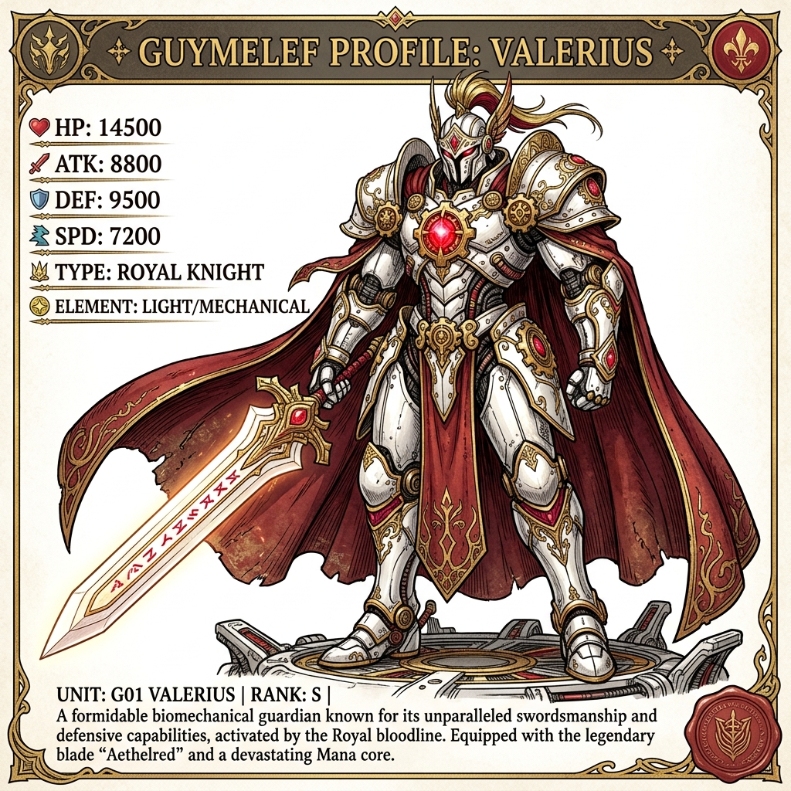

# DRAKHART — Dark Fantasy Action-Platformer


DRAKHART is a side-scrolling dark fantasy action-platformer built with Phaser 3, TypeScript, and Vite. The game features a fluid, three-phase prototype level where combat and navigation styles change dynamically based on your current form.

## ⚔️ The Three Modes

Discover and unlock three unique states, blending classic platforming with high-octane biomechanical mecha combat and horizontal flight mechanics:

| Warrior Mode | Guymelef Mecha Mode | Dragon-Mech Mode |
| :---: | :---: | :---: |
|  |  |  |
| Agile platforming and classic sword fighting. | Heavy armor, barricade smashing, and claymore swings. | Free-flight shmup-style gorge navigation. |

---

## 🎮 Game Architecture & Tech Stack

- **Game Engine**: Phaser 3.80+ (using high-performance procedural drawing and graphics texture rendering).
- **Language**: TypeScript 5 (Strict Mode).
- **Bundler**: Vite 5.
- **Dynamic Physics Scaling**: Automatic arcade-body scaling and custom center gravity offsets for each unique form (Warrior scale `0.8x`, Mecha scale `1.4x`, Dragon scale `1.45x`).
- **Responsive Scales**: Scales to fit any display resolution with responsive canvas scale modes.

---

## 🚀 Quick Start

To install and run the development server locally:

```bash
# Install dependencies
npm install

# Start development server
npm run dev

# Build production bundle
npm run build
```
