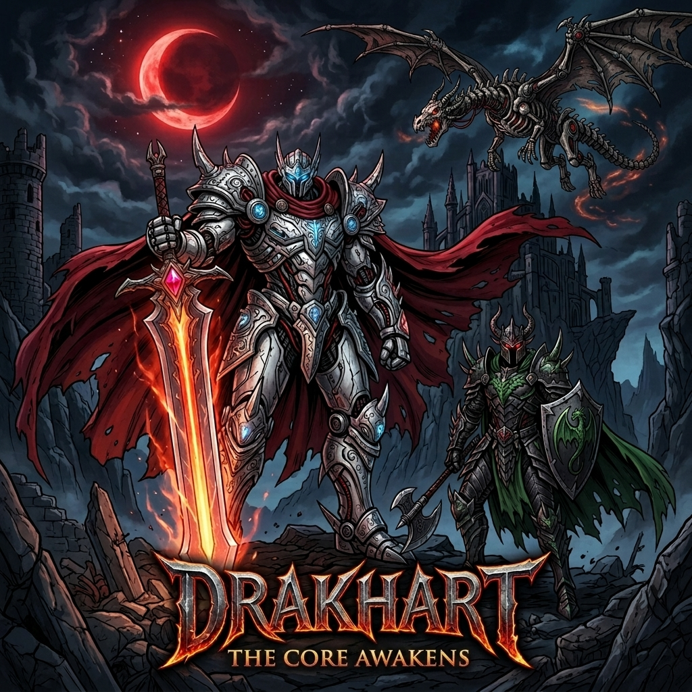
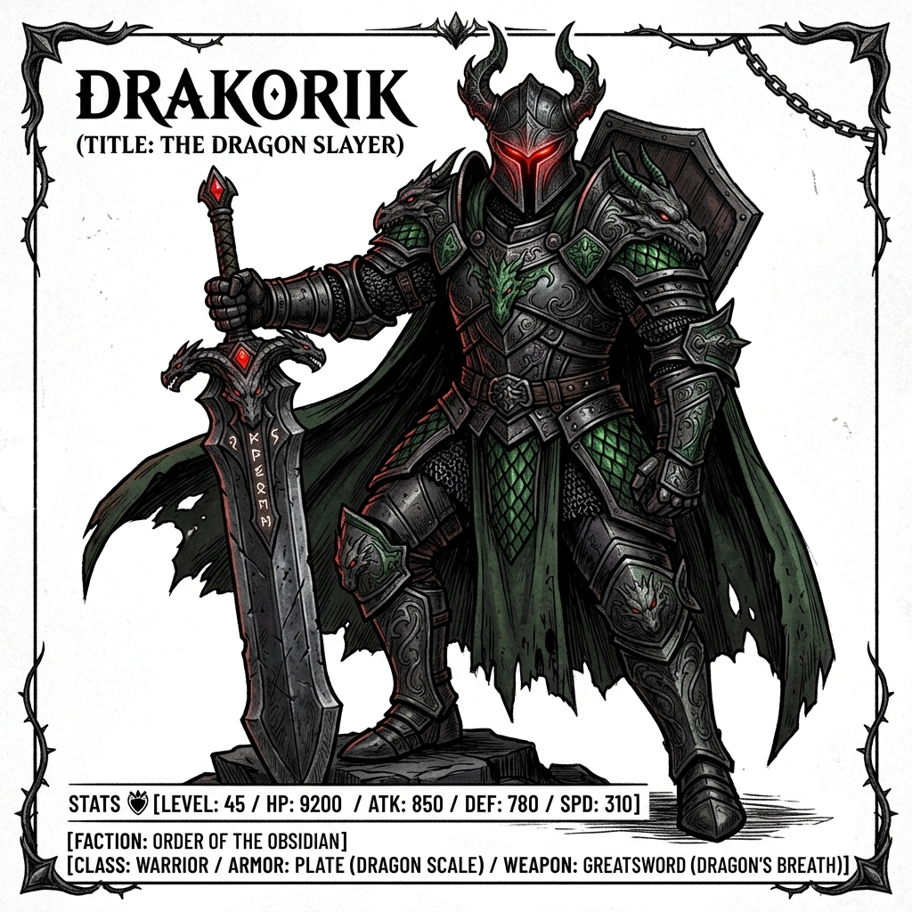
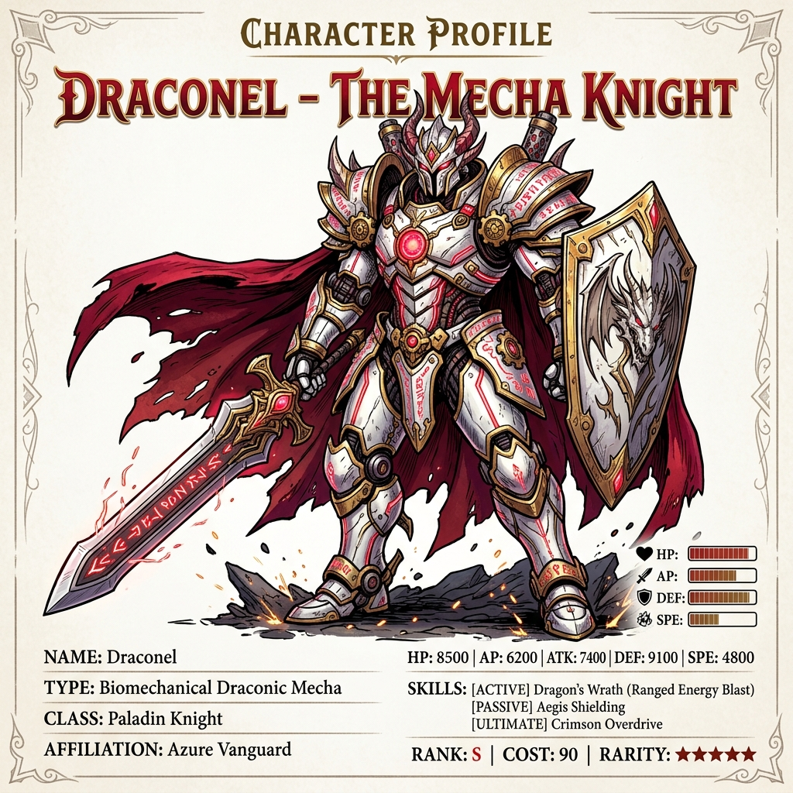
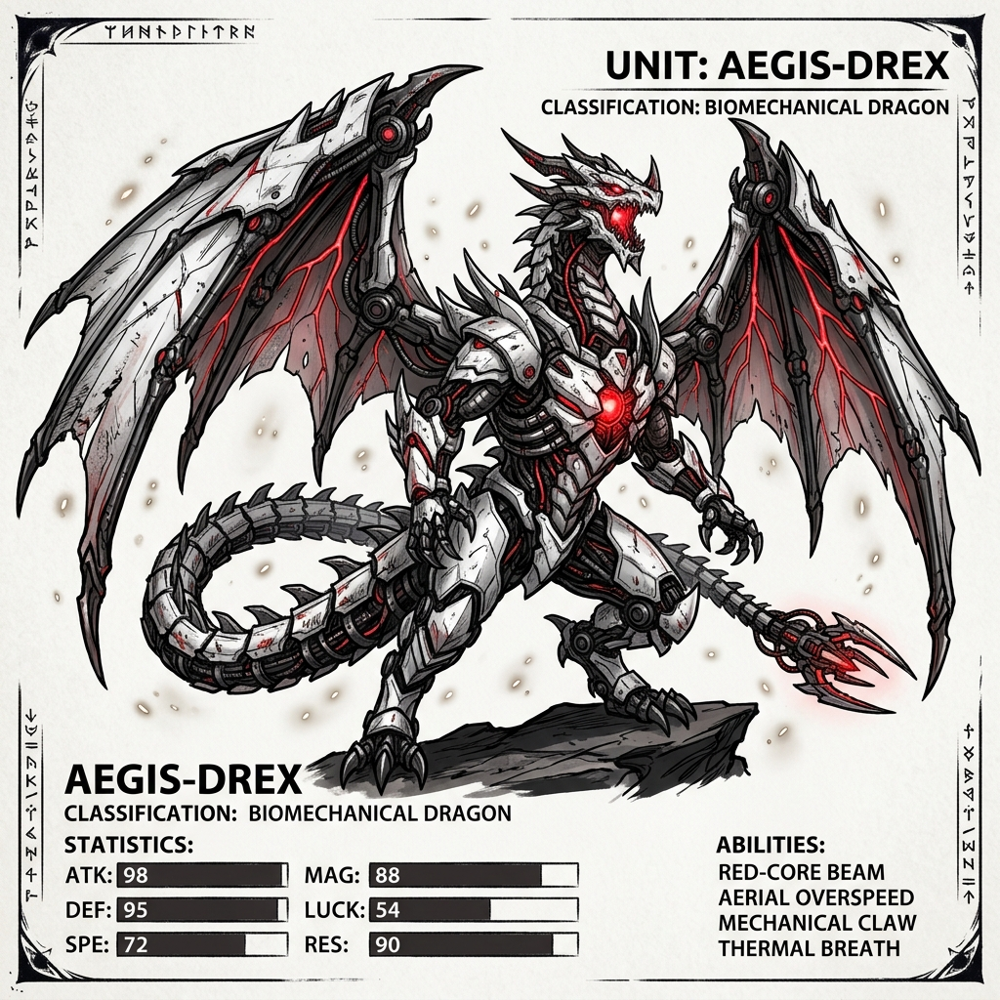
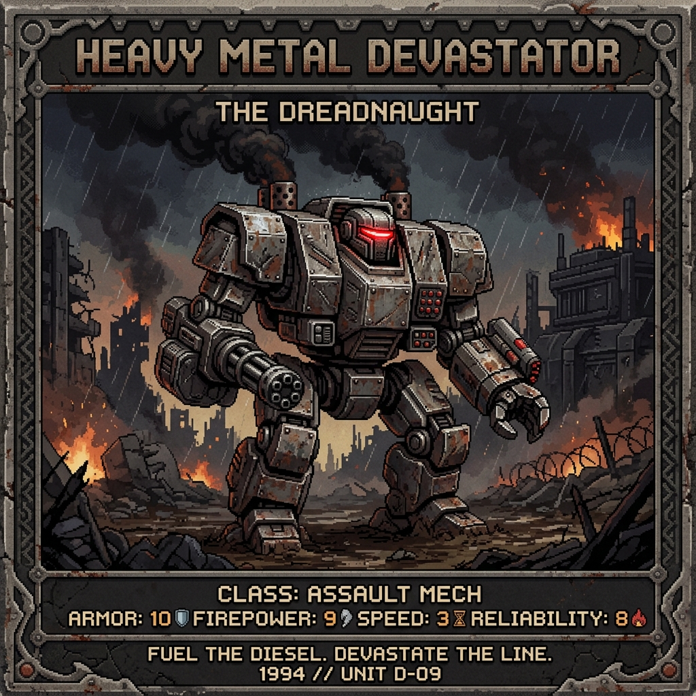
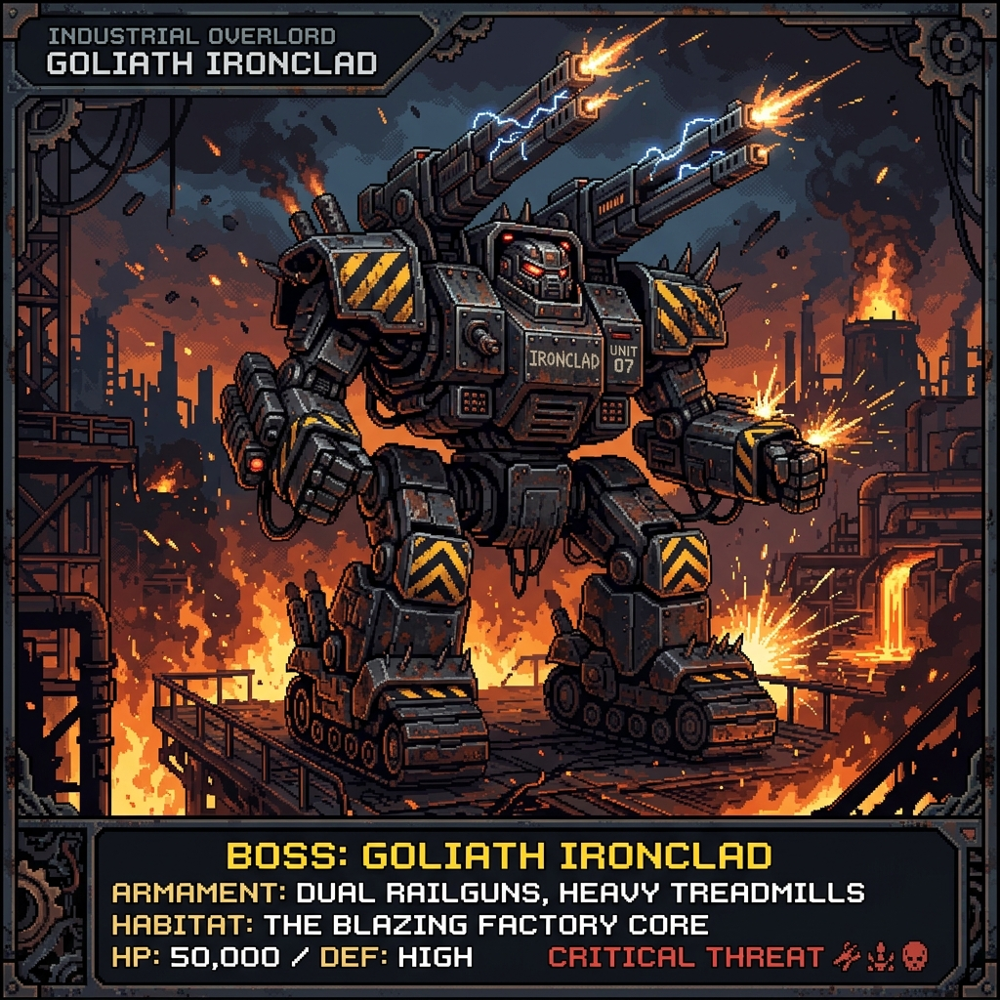

# 🐉 DRAKHART — The Core Awakens

[](https://github.com/raestrada/drakhart/actions/workflows/deploy.yml)
[](LICENSE)
[](https://phaser.io/)
[](https://www.typescriptlang.org/)



> *"The ancient world bonded with dragons, building biomechanical gods of bone and magical steel. The rising Iron Empire eliminated this magic, replacing it with massive, brutalist military engines of steel and steam. They sought to suppress the ancient dragon-core technology forever... but the last beating Dragon Core lives inside your chest."*

---

## 🎮 Play the Live Game
Experience the grimdark fantasy action-platformer directly in your browser:
### 👉 [**PLAY DRAKHART LIVE ON GITHUB PAGES**](https://raestrada.github.io/drakhart/) 👈

---

## 🕹️ About the Game
**DRAKHART** is a grimdark fantasy action-platformer that fuses **three distinct genres into a single, continuous, genre-bending adventure**. Blending the earned transformations of Atari’s *Draconus (1988)*, the biomechanical clockwork mecha designs of *Vision of Escaflowne (1996)*, and the tactical arcade horizontal scrolling of *R-Type*, DRAKHART casts you as **The Warden**—a silent knight bonded with a forgotten, living mechanical dragon core made of bone and steel, fighting to protect the Shattered Continent from the Iron Empire's industrialized, brutalist military war machines.

---

## 🎮 The Three Forms of Destiny

Seamlessly shift between three radically different forms at the press of a key `[C]`. Every transformation triggers a cinematic transition: a burst of screen particles, operatic music swells, camera shakes, and shifts in camera zoom.

| 🟢 Human Form: The Warden | ⚪ Mecha Form: The Draconel | 🔵 Dragon Form: The Sky Graver |
| :---: | :---: | :---: |
|  |  |  |
| **Precision Platformer** | **Heavy Mecha Combat** | **Horizontal Shmup** |
| Agile, swift, and classic. Explore tight caverns, dodge traps, and strike fast with your short sword. Human form is essential for accessing narrow passages. | A titanic, white-and-gold biomechanical knight mecha forged from ancient dragon bones and magical metal plates. Smash through the Empire's heavy military stone gates and obliterate guards with your massive Claymore. | A flying mecha-dragon of steel, bone, and core energy. Take to the skies in horizontal forced-scrolling shmup sections, dogfight the Empire's brutalist aerial drones, and breathe fire. |

---

## ⚙️ The Enemy Arsenal: Brutalist Industrial Military Might

The Iron Empire has suppressed and outlawed the ancient, organic dragon-mecha magic. In its place, they deploy brutalist, blocky, and mass-produced military mechas—imposing war machines of dark riveted iron, smoke exhaust vents, and physical firepower (resembling classic *MechWarrior* aesthetics).

| 🔴 Standard Trooper: Iron Guard | 💀 Heavy Mini-Boss: Draconel Bastion |
| :---: | :---: |
|  |  |
| **Mass-Produced Heavy Unit** | **Colossal Smelting Guardian** |
| The frontline soldier of the Empire. Built of thick, square-angled steel plates and powered by roaring diesel engines, the Iron Guard charges players with a heavy energy pike, ignoring weak sword slashes. | A colossal, multi-legged mobile defense system and industrial guardian. Fitted with tank treads, heavy railguns, and hazard warnings, it unleashes magma cannon spreads and heavy ground stomps. |

---

## ⚡ Key Features

### ⚔️ Genre-Bending Synergy
Transition from a tactical metroidvania into an intense arcade horizontal shooter in a single heartbeat. DRAKHART doesn't partition its genres; they coexist. Navigate tunnels as a human, break down ruins as a mecha, and fly over chasms as a dragon to escape collapsing canyons.

### 🚪 "Wrong-Form-Inconvenience" (The Soft-Gate Philosophy)
No artificial colored keycards or red locked doors. You can explore the continent in any form you choose. However, using the wrong form is **inconvenient and deadly**:
- **Low Ceilings**: The Mecha is too tall and gets physically stuck in low-clearance Warden tunnels.
- **Bottomless Chasms**: Human and Mecha forms will immediately fall to their doom; only the Dragon can soar across.
- **Lava Fields**: Lava drains a human's health in seconds, but Mecha's heavy insulated armor boots can walk right through.
- **Bullet Hell**: Dodging dense drone patterns on foot is a nightmare; transforming into the agile flying Dragon makes navigation a breeze.

### 🂡 Tarot RPG Progression (War Echoes)
Discover **10 Major Arcana Tarot Cards** hidden throughout the world. Each card contains a *War Echo*—the final memory of a dragon or Warden who fell during the war. Absorbing these cards unlocks permanent upgrades:
- **The Magician (I)**: Grants the Warden a **Double Jump**.
- **Strength (VIII)**: Increases Mecha Claymore damage by 50%.
- **The Tower (XVI)**: Grants the Dragon a **3-way fire spread shot**.
- **The World (XXI)**: Fully maps the Shattered Continent and unlocks warp checkpoints.

### 🌡️ Tactical Heat Management
The Draconel Mecha is a powerful engine of destruction, but it runs *hot*. Striking with your claymore or taking hits increases your **Heat Level**. Fail to manage your vents and your mecha will trigger an **Emergency Shutdown**—leaving you frozen and vulnerable.

---

## 🛠️ Tech Stack & Architecture

- **Game Engine**: Phaser 3.80+ (using Arcade Physics and custom Canvas-rendered shaders).
- **Language**: TypeScript 5 (Strict Mode).
- **Bundler**: Vite 5 for instant development reloading (HMR).
- **Systems Core**:
  - `FormStateMachine`: Human ➔ Mecha ➔ Dragon. Handles gravity toggling, physics size shifts, and camera zoom.
  - `TarotSystem`: Manages the deck, card activation, and persistence.
  - `HeatSystem`: Manages mecha temperature, overheating triggers, and shutdowns.
  - `ShmupSystem`: Toggles forced horizontal scroll, auto-camera panning, and wave spawning.
- **Dynamic Physics Scaling**: Sprite assets dynamically scale (Warden `0.8x`, Mecha `1.4x`, Dragon `1.45x`), automatically scaling hitboxes and projecting shadows matching their size.

---

## 🚀 Quick Start (Local Setup)

To launch the prototype on your local machine:

```bash
# 1. Clone the repository
git clone https://github.com/raestrada/drakhart.git
cd drakhart

# 2. Install dependencies
npm install

# 3. Run the Vite development server with HMR
npm run dev

# 4. Compile TypeScript & build the production package
npm run build
```

---

## 🎮 Default Controls

- **Move / Steer**: `ARROWS` or `WASD`
- **Jump / Fly Up**: `UP` or `W`
- **Attack / Fire**: `X` (hold down for continuous fire in Dragon flight)
- **Transform**: `C` (requests transition: *Human ➔ Mecha ➔ Dragon ➔ Revert*)

---

## 🤝 Open Source (OSS) Best Practices & Contributing

We welcome community contributions, suggestions, and feedback! Please follow these standards when contributing to Drakhart:

### Code Quality & Standards
- All code and code comments must be written in **English**.
- The project runs on TypeScript **strict mode**. Ensure there are no implicit `any` types or unresolved null checks.
- Keep game tuning values centralized inside [constants.ts](src/utils/constants.ts). Do not hardcode speeds, damage, or durations inside game files.
- Always run `npm run build` locally before pushing to verify compile type-safety and ensure the Vite production bundler compiles correctly.

### Internationalization (i18n)
- Drakhart features a custom, lightweight translation engine. 
- [en.ts](src/i18n/en.ts) is the source of truth for text strings.
- Spanish translations in [es.ts](src/i18n/es.ts) must exactly match the key structure of English.
- Avoid hardcoding display text in scenes; always fetch translations via `t('category.stringName')`.

### Submitting a Pull Request
1. Fork the repository and create a feature branch (`git checkout -b feature/awesome-feature`).
2. Add features, fix bugs, and write clean, modular code.
3. Commit your changes (`git commit -m 'feat: Add awesome feature'`).
4. Push to the branch (`git push origin feature/awesome-feature`).
5. Open a Pull Request on GitHub.

---

## 📜 License

This repository is published under a dual-licensing scheme restricting commercial usage:

* **Source Code**: Licensed under the **PolyForm Noncommercial License 1.0.0** (allows educational, personal, and noncommercial distribution and modifications; prohibits selling, renting, monetizing, or commercial use). See [LICENSE](LICENSE#1-software-code-license) for details.
* **Game Assets & Media**: Licensed under the **Creative Commons Attribution-NonCommercial 4.0 International License (CC BY-NC 4.0)**. See [LICENSE](LICENSE#2-game-assets-and-artwork-license) for details.
